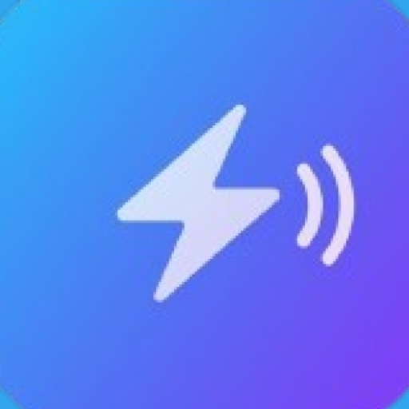

<div align="center">



<br />

# **PingMate**

### *Smart Notification Hub for Android*

**One feed · AI summaries · Reminders — No account required.**

<br />

[](https://kotlinlang.org)
[](https://developer.android.com/jetpack/compose)
[](https://developer.android.com)
[]()
[]()

</div>

---

## Table of Contents

- [Overview](#-overview)
- [Screenshots](#-screenshots) — Welcome · Choose Apps · Home · Set Reminder · AI Assistant · Settings
- [Key Features](#-key-features)
- [App Flow](#️-app-flow)
- [Architecture](#️-architecture)
- [Tech Stack](#️-tech-stack)
- [Getting Started](#-getting-started)
- [Project Structure](#-project-structure)
- [Configuration](#️-configuration)
- [Documentation](#-documentation)
- [Upcoming Features](#-upcoming-features)
- [License](#-license)

---

## 📖 Overview

**PingMate** (also known as *NotiFlow AI*) is a modern Android application that brings all your app notifications into a single, intelligent feed. Choose which apps to track—WhatsApp, Gmail, Instagram, and more—and see every alert in one place with search, filters, and optional **AI-powered summaries** via Google Gemini. Set reminders on any notification or create standalone reminders, and control your data with per-app or full clear—all without signing up or creating an account.

Built with **Jetpack Compose** and **Material 3**, the app offers a clean dark-theme experience, a voice-enabled AI assistant, and a home-screen widget for quick access.

---

## 📱 Screenshots

Add your own screenshots below. Recommended: capture each screen on a device or emulator, save as PNG, place in a `/docs/screenshots` or `/assets` folder, and reference them here.

---

### 1. Welcome & Onboarding

First-time users see a welcome screen with the app value proposition and a single **Get Started** action. After granting notification access, they land on **Choose Apps**.

| |
|:--:|
| *Screenshot: **Welcome screen** — App name, tagline, three feature cards (Powered by Gemini AI, Smart Notification Feed, Privacy First), and the primary CTA button.* |
| 📁 `docs/screenshots/welcome.png` |

---

### 2. Choose Apps Screen

Users select which applications they want PingMate to track. Only notifications from these apps appear in the feed.

| |
|:--:|
| *Screenshot: **Choose Apps** — List of installed apps with icons and names; checkboxes to select/deselect. Search and “Done” or “Continue” to proceed to Home.* |
| 📁 `docs/screenshots/choose_apps.png` |

---

### 3. Home Screen

The main dashboard: a paginated list of notifications with app icon, title, content, and time. Date strip (Today, Yesterday, etc.), app filter chips, search, and a floating action button for the AI assistant. Reminders section shows upcoming alerts.

| |
|:--:|
| *Screenshot: **Home** — Top bar with app logo and “PingMate”, “RECENT ALERTS” header with notification count badge, scrollable notification cards (with avatars/media where available), date strip, filter row, and Voice AI FAB.* |
| 📁 `docs/screenshots/home.png` |

---

### 4. Set Reminder Screen

Tapping “Set reminder” on a notification (or creating a general reminder) opens a dialog with a combined **date & time** picker in one row and an optional note field.

| |
|:--:|
| *Screenshot: **Set Reminder** — Dialog titled “Schedule Alert” or “Schedule Reminder”, notification context bubble, single row showing date and time (e.g. “25 Mar 2026   10:30 AM”), note field, and Schedule / Dismiss buttons.* |
| 📁 `docs/screenshots/set_reminder.png` |

---

### 5. AI Assistant Screen

Full-screen overlay for the voice AI: Lottie animation, microphone state (“Listening…” / “Starting…”), and the AI summary result in a compact card once processing completes.

| |
|:--:|
| *Screenshot: **AI Assistant** — Dark overlay, centered Lottie animation, prompt/transcription text, and the summary result card with “YOUR REQUEST” and “PINGMATE INTELLIGENCE” sections. Close button at top.* |
| 📁 `docs/screenshots/ai_assistant.png` |

---

### 6. Settings Screen

Central place for Gemini API key, app selection, AI exclusions, and clearing notifications.

| |
|:--:|
| *Screenshot: **Settings** — Sections: Gemini API (key input), Choose applications (navigate to app picker), Exclude from AI (per-app toggles), Clear messages (opens dialog to clear by app or clear all). Back arrow in top bar.* |
| 📁 `docs/screenshots/settings.png` |

---

## ✨ Key Features

| Feature | Description |
| :--- | :--- |
| **Onboarding** | Welcome → Notification access permission → Choose apps to track. One-time flow; returning users open directly on Home. |
| **Unified feed** | Paginated list with app icon, title, content, time. Filter by app, search by text, filter by date. Favorites and swipe-to-delete. |
| **Sender & media** | Displays notification large icon (e.g. contact avatar) and big picture (e.g. shared image) when provided by the source app. |
| **Voice AI assistant** | Tap FAB or widget → speak or type → receive a summary powered by **Google Gemini**. API key configured in Settings. |
| **Reminders** | Combined date & time picker and note on a notification, or standalone general reminder. Upcoming reminders on Home; alarms via `AlarmManager`. |
| **Settings** | Gemini API key, choose apps, exclude apps from AI, clear messages by app or clear all. |
| **Home screen widget** | Quick-launch tile for the AI assistant. |
| **Dynamic count** | Badge shows real notification count for the current filters (date, app, search). |
| **Empty state** | “No Notifications Yet” with icon and refresh when the list is empty. |

---

## 🗺️ App Flow

```
Welcome  →  Permission  →  Choose Apps  →  Home  ⇄  Settings
```

- **First launch:** Welcome → Permission → Choose Apps → Home.
- **Later launches:** If onboarding is complete and notification access is enabled, the app opens on **Home**.
- **Home:** Notification list (paged), date strip, app filter, search, reminders section, FAB for Voice AI. Tap a notification for details; set reminder, favorite, delete, or open in the original app.
- **Settings:** Opened from Home; from here you can re-open Choose Apps and use Clear messages (by app or clear all).

---

## 🏗️ Architecture

```
┌─────────────────────────────────────────────────────────────────┐
│                     UI Layer · Jetpack Compose                    │
│  WelcomeScreen · PermissionScreen · ChooseAppsScreen ·            │
│  HomeScreen · SettingsScreen · VoiceAssistantScreen · Dialogs    │
└─────────────────────────────┬───────────────────────────────────┘
                              │
┌─────────────────────────────▼───────────────────────────────────┐
│                   ViewModels & Navigation                        │
│  HomeViewModel (paging, filters, AI, reminders) ·                 │
│  ChooseAppsViewModel · NavGraph (single Activity)                │
└─────────────────────────────┬───────────────────────────────────┘
                              │
┌─────────────────────────────▼───────────────────────────────────┐
│                    Data & Business Logic                          │
│  Room (NotificationDao, GeneralReminderDao) ·                      │
│  SharedPreferences (tracked apps, API key, onboarding) ·         │
│  OfflineSummarizationEngine (Gemini API) · ReminderNlp            │
└─────────────────────────────┬───────────────────────────────────┘
                              │
┌─────────────────────────────▼───────────────────────────────────┐
│                     System & Services                             │
│  PingMateNotificationService (NotificationListenerService) ·     │
│  ReminderReceiver (AlarmManager) · AiWidgetActivity · Widget      │
└─────────────────────────────────────────────────────────────────┘
```

- **Single Activity:** `MainActivity` hosts the Compose UI and `PingMateNavGraph`. No fragments.
- **State:** ViewModels expose `StateFlow` / `Flow`; UI uses `collectAsState()` and `collectAsLazyPagingItems()`. ViewModels and utilities talk to Room and SharedPreferences directly.
- **Notifications:** `PingMateNotificationService` receives system notifications, filters by tracked apps, deduplicates by `notificationKey`, and inserts/updates `NotificationEntity` in Room. Large icon and big picture are stored as Base64 when available.
- **AI:** `OfflineSummarizationEngine` builds a minimal text context from recent notifications, calls the Gemini REST API with the user’s API key, and parses the response. Used by `HomeViewModel` when the user triggers the voice assistant or summary.
- **Reminders:** Stored in Room (`NotificationEntity.reminderTime` / `GeneralReminderEntity`). `AlarmManager` and `ReminderReceiver` post a notification at the scheduled time.

---

## 🛠️ Tech Stack

| Layer | Technology |
| :--- | :--- |
| **Language** | Kotlin `2.0.21` |
| **UI** | **Jetpack Compose** (Material 3), Compose BOM `2024.09` |
| **Navigation** | Navigation Compose `2.7.7` |
| **Local DB** | Room `2.6.1` · Paging 3 `3.2.1` |
| **Async** | Kotlin Coroutines `1.8.1` · Flow |
| **DI** | Koin `3.5.6` |
| **Widget** | Glance `1.1.0` (App Widget) |
| **Other** | DataStore Preferences · Splash Screen API · Lottie Compose `6.3.0` · ML Kit (entity extraction, smart reply) |
| **Build** | Gradle `8.13` · AGP `8.13.2` · KSP `2.0.21-1.0.27` |

**SDK:** `minSdk 29` · `targetSdk 36` · `compileSdk 36`

---

## 🚀 Getting Started

### Requirements

- **Android Studio** (latest stable recommended)
- **JDK 11**
- **Android SDK** with API 29+
- **Device or emulator** on Android 10+ for notification listener and exact alarms

### Clone and open

```bash
git clone https://github.com/your-org/PingMate.git
cd PingMate
```

Open the project in Android Studio (**File → Open** → select the project folder) and let Gradle sync.

### Build and run

**Debug:**

```bash
./gradlew assembleDebug
adb install -r app/build/outputs/apk/debug/app-debug.apk
```

Or use **Run → Run 'app'** in Android Studio.

**Release:** Configure signing in `app/build.gradle.kts`, then:

```bash
./gradlew assembleRelease
```

### First run

1. Grant **Notification access** when prompted (required for the feed).
2. **Choose apps** to track (e.g. WhatsApp, Gmail).
3. On **Home**, notifications from those apps will appear. To use AI summaries, go to **Settings** and add your **Gemini API key** ([Get one here](https://aistudio.google.com/apikey)).

---

## 📂 Project Structure

```
app/src/main/
├── java/com/app/pingmate/
│   ├── MainActivity.kt
│   ├── data/local/
│   │   ├── PingMateDatabase.kt
│   │   ├── dao/NotificationDao.kt, GeneralReminderDao.kt
│   │   └── entity/NotificationEntity.kt, GeneralReminderEntity.kt
│   ├── presentation/
│   │   ├── navigation/NavGraph.kt
│   │   └── screen/
│   │       ├── onboarding/WelcomeScreen.kt, PermissionScreen.kt
│   │       ├── apps/ChooseAppsScreen.kt, ChooseAppsViewModel.kt
│   │       ├── dashboard/
│   │       │   ├── HomeScreen.kt, HomeViewModel.kt
│   │       │   ├── VoiceAssistantScreen.kt, VoiceAiDialog.kt
│   │       │   ├── SetReminderDialog.kt, CalendarStrip.kt
│   │       └── settings/SettingsScreen.kt
│   ├── service/PingMateNotificationService.kt
│   ├── receiver/ReminderReceiver.kt
│   ├── widget/AiWidgetActivity.kt, AiAssistantWidgetProvider.kt
│   ├── utils/
│   │   ├── OfflineSummarizationEngine.kt
│   │   ├── SpeechRecognizerManager.kt
│   │   ├── ReminderNlp.kt
│   │   └── NotificationIntentCache.kt
│   └── ui/theme/Color.kt, Theme.kt, Type.kt
├── res/
│   ├── layout/, drawable/, values/
│   ├── raw/ (e.g. ai_animation.json for Lottie)
│   └── xml/ (widget, backup, data extraction)
└── AndroidManifest.xml
```

---

## ⚙️ Configuration

| What | Where / How |
| :--- | :--- |
| **Gemini API key** | In-app: **Settings → Gemini API Key**. Stored locally (SharedPreferences); not hardcoded. |
| **Tracked apps** | **Settings → Choose applications** (or during onboarding). Stored in SharedPreferences. |
| **Exclude from AI** | **Settings → Exclude from AI** (per-app toggles). Notifications from these apps are omitted from the context sent to Gemini. |

No environment variables or build-time secrets are required for basic use.

---

## 📚 Documentation

| Document | Description |
| :--- | :--- |
| [**docs/PRESENTATION_APP_JOURNEY.md**](docs/PRESENTATION_APP_JOURNEY.md) | App journey, feature summary, and one-pager for team or presentation. |
| [**docs/SAMPLE_PROMPTS_FOR_PRESENTATION.md**](docs/SAMPLE_PROMPTS_FOR_PRESENTATION.md) | Sample design and CLI prompts used during development. |
| [**docs/APP_LOGO_PROMPT.md**](docs/APP_LOGO_PROMPT.md) | Prompt and guidelines for generating the app logo. |

---

## 🔮 Upcoming Features

- **Cloud backup / sync** — Optional backup of notification history or reminders.
- **More AI models** — Support for additional providers or model selection in Settings.
- **Notification actions** — Quick reply or action buttons from the feed where the source app supports it.
- **Wear OS** — Companion tile or app for quick summary and reminders.
- **Themes** — Light theme and accent customization.
- **Analytics (opt-in)** — Crash and usage metrics to improve stability and UX.

---

## 📄 License

[Specify your license here, e.g. MIT, Apache 2.0, or proprietary.]

---

<div align="center">

**PingMate** — Your notifications, summarized and under control.

</div>
