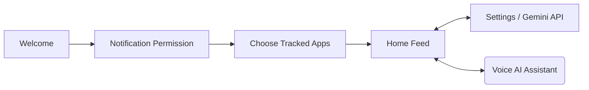

<div align="center">


# ⚡ PingMate (NotiFlow AI)

**Your Intelligent, Privacy-First Notification Hub**

[](https://kotlinlang.org)
[](https://developer.android.com/jetpack/compose)
[](https://developer.android.com)
[]()
[]()

_One unified feed. AI-powered summaries. Smart reminders. Zero accounts required._ <br>
_Reclaim your focus by letting PingMate handle the notification noise through the power of on-device ML and Gemini AI._

### 📥 Get the Application
[](#-direct-download-for-non-technical-users)

[Key Features](#-key-features) • [Quick Install](#-direct-download-for-non-technical-users) • [Developer Setup](#-getting-started-for-developers) • [Screenshots](#-screenshots)

</div>

---

> [!IMPORTANT]  
> **Gemini API Key Required for AI Features**  
> PingMate is completely free, open-source, and does not require an account. However, to use the **AI Voice Assistant** and **Smart Summarization** features, you must provide your own private Google Gemini API key.  
> 1. Get a free key in seconds from **[Google AI Studio](https://aistudio.google.com/apikey)**.  
> 2. Open the PingMate app, go to **Settings > Gemini API Key**, and paste your key.  
> *Your key is stored 100% securely and locally on your device. It is never shared with us or any third-party servers.*

---

## 🌟 Why PingMate?

Notifications today are overwhelming. **PingMate** reclaims your focus by acting as an intelligent intermediary between your apps and your attention. Built purely with modern Android technologies, PingMate ingests, filters, and summarizes your alerts securely using on-device Machine Learning and optional Gemini AI integrations. 

Whether you are a busy professional trying to declutter your status bar, or a developer looking to explore cutting-edge Android architecture, PingMate provides a seamless, beautiful, and highly customizable experience. You'll never miss what matters while muting the noise.

---

## 🚀 Key Features

<table>
  <tr>
    <td>
      <br><strong>🎙️ Voice AI Assistant</strong><br>
      Fully integrated with Google Gemini to summarize notifications via natural speech or text.<br><br>
    </td>
    <td>
      <br><strong>🗂️ Unified Smart Feed</strong><br>
      Your alerts from WhatsApp, Gmail, Instagram, etc., paginated and organized into one sleek dashboard.<br><br>
    </td>
  </tr>
  <tr>
    <td>
      <br><strong>⏰ Contextual Reminders</strong><br>
      Set time-based alarms linked directly to specific notifications, or create standalone reminders effortlessly.<br><br>
    </td>
    <td>
      <br><strong>🔒 Privacy First</strong><br>
      No accounts. No sign-ups. Your data stays on your device—communicating only directly with the Gemini API (when configured by you).<br><br>
    </td>
  </tr>
  <tr>
    <td>
      <br><strong>🎨 Material Design 3</strong><br>
      Stunning Jetpack Compose UI adapting to system dark mode with buttery-smooth animations and dynamic widget support.<br><br>
    </td>
    <td>
      <br><strong>🖼️ Rich Media Previews</strong><br>
      See large contact avatars and big-picture media natively parsed straight from the original notifications.<br><br>
    </td>
  </tr>
</table>

---

## 📱 Screenshots

<div align="center">
  
  
  
  
</div>
<div align="center">
  
  
  
  
</div>

---

## 📥 Direct Download (For Non-Technical Users)

You do not need to be a developer to use PingMate! If you just want to install the app on your Android phone, follow these simple steps:

1. **Download the App:**  
   👉 **[Click Here to Download `pingmate-release.apk`](#)** *(Note to repository owner: Update this link with your actual GitHub Release URL)*
2. **Install the APK:**  
   Locate the downloaded `.apk` file in your phone's "Downloads" folder or file manager and tap it. If prompted, allow your phone to "Install unknown apps" from your browser or file manager.
3. **Grant Permissions:**  
   Open PingMate. The app will ask for "Notification Access". This is strictly required so PingMate can read, organize, and summarize your alerts.
4. **Activate AI Summaries:**  
   As mentioned above, grab a free API key from [Google AI Studio](https://aistudio.google.com/apikey), then paste it into the application's **Settings** screen. You're all set!

---

## 🛠️ Tech Stack & Architecture

PingMate leverages modern Android development paradigms to ensure a robust, maintainable, and highly performant application.

### 🏗️ MVVM & Clean Architecture
- **UI Architecture:** 100% Jetpack Compose (Material 3), Navigation Compose
- **Concurrency:** Kotlin Coroutines & Flow
- **Data Persistence:** Room Database (Paging 3 Support), DataStore Preferences
- **Dependency Injection:** Koin
- **Background Work:** WorkManager, Android Services (`NotificationListenerService`)
- **AI & ML:** Gemini SDK (offline summarization engine), Google ML Kit (Entity Extraction, Smart Reply)
- **Widgets:** Glance App Widget
- **Build System:** Gradle Kotlin DSL (KTS), Version Catalogs

### 🧩 App Flow


---

## 🎮 Getting Started (For Developers)

### Prerequisites

- **Android Studio** (Koala or newer recommended)
- **JDK 11+**
- **Android SDK** API 29 or higher (Android 10+)
- **Device or Emulator** (API 29+) required for `NotificationListenerService` and Exact Alarms testing.

### Local Installation

1. **Clone the repository:**
   ```bash
   git clone https://github.com/your-username/PingMate.git
   cd PingMate
   ```
2. **Open the project in Android Studio** and allow Gradle to sync.
3. **Build & Run** on your device or emulator:
   ```bash
   ./gradlew installDebug
   ```

---

## 📂 Project Structure

```text
com.app.pingmate/
├── data/             # Room DB configurations, DAOs, Entities
├── presentation/     # Jetpack Compose UI, ViewModels, Navigation Graphs
│   ├── onboarding/   # Walkthrough & Permissions flow
│   ├── dashboard/    # Home Feed, AI Voice Overlay, Reminders dialog
│   └── settings/     # App Configuration, Exclusions, API Keys
├── service/          # Core NotificationListenerService implementation
├── receiver/         # AlarmManager Broadcast Receivers for reminders
├── widget/           # Glance-based Home Screen widgets
└── utils/            # AI Engines, ML Kit integration, Date formatters
```

---

## 🔮 Roadmap & Upcoming Features

- [ ] **Cloud Sync:** Optional, secure backup of your notification history (encrypted).
- [ ] **Expanded AI Selection:** Native support for choosing local/custom LLMs.
- [ ] **Quick Reply Actions:** Reply directly within the PingMate feed without opening the parent application.
- [ ] **Wear OS Component:** Companion smartwatch app for rapid notification summaries.
- [ ] **Advanced Theming:** Pure black AMOLED themes and extensive accent color customization.

---

## 🤝 Contributing

We welcome contributions to make PingMate even better! 

1. Fork the Project
2. Create your Feature Branch (`git checkout -b feature/AmazingFeature`)
3. Commit your Changes (`git commit -m 'Add some AmazingFeature'`)
4. Push to the Branch (`git push origin feature/AmazingFeature`)
5. Open a Pull Request

---

## 📄 License

Distributed under the **MIT License**. Please see `LICENSE` for more information.

---

<div align="center">
  <b>PingMate</b> — Notifications, un-cluttered. <br>
  Designed & built with ❤️ for Android.
</div>
